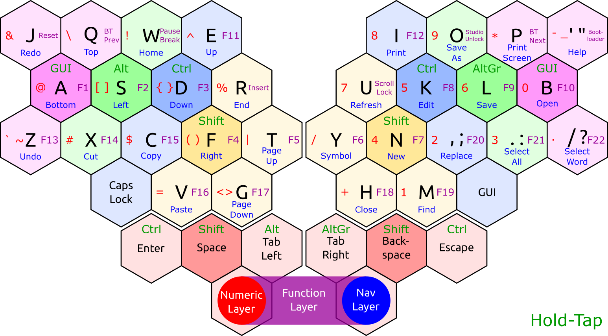

This project defines a ZMK shield for [Felix Kühling's Mantis keyboard](https://github.com/fxkuehl/mantis/tree/main).

Currently the shield includes support for ZMK Studio but not for the RGB LED backlight.

>
>_Default keymap for the Mantis ZMK shield._